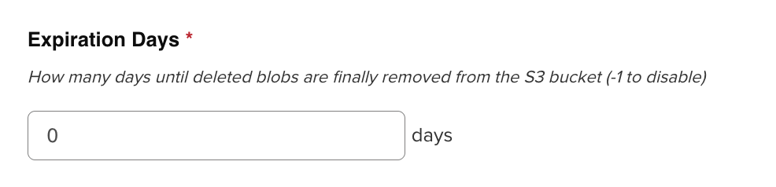

### Cоздание Бакетов
```bash
root@sanich ~/transfer main
❯ mc du myminio/helm  
0B     0 object        helm

root@sanich ~/transfer main
❯ mc du myminio/mv2 
0B      0 objects       mv2

root@sanich ~/transfer main
❯ mc du myminio/dckr                   
0B      0 objects       dckr
```

### ВАЖНО:
  Значение *Expliration Days* равное -1 отключает удаление из s3 (то есть файлы будут висеть мертвым)


### После создание блоба в Nexus
```bash
❯ mc du myminio/helm  
40B     1 object        helm


root@sanich ~/transfer main
❯ mc du myminio/mv2
40B     1 object        mv2

root@sanich ~/transfer main
❯ mc du myminio/dckr
40B     1 object        dckr
```

# После создания Репозиториев объем не поменялся


### Тестовый образ Helm 

```bash
root@sanich ~/transfer main*
❯ helm create testchart

Creating testchart

root@sanich ~/transfer main*
❯ helm package testchart

Successfully packaged chart and saved it to: /root/transfer/testchart-0.1.0.tgz

root@sanich ~/transfer main*
❯ curl -u <name>:<pass> \
  --upload-file testchart-0.1.0.tgz \
  https://sanich.space/repository/helm-test/


root@sanich ~/transfer main*
❯ mc du myminio/helm      
4.7KiB  5 objects       helm
```

### Тестовый образ maven2

```bash
root@sanich ~/transfer main*
❯ mkdir test-maven-artifact && cd test-maven-artifact

cat > Test.java <<EOF
public class Test {
    public static void main(String[] args) {
        System.out.println("Hello from Maven artifact!");
    }
}
EOF

# Скомпилируем
javac Test.java

# Упакуем в .jar
jar cf test-artifact.jar Test.class


root@sanich ~/transfer/test-maven-artifact main*
❯ cat > pom.xml <<EOF
<project xmlns="http://maven.apache.org/POM/4.0.0"
         xmlns:xsi="http://www.w3.org/2001/XMLSchema-instance"
         xsi:schemaLocation="http://maven.apache.org/POM/4.0.0
                             http://maven.apache.org/xsd/maven-4.0.0.xsd">
  <modelVersion>4.0.0</modelVersion>
  <groupId>com.sanich</groupId>
  <artifactId>test-artifact</artifactId>
  <version>1.0.0</version>
  <packaging>jar</packaging>
</project>
EOF


root@sanich ~/transfer/test-maven-artifact main*
❯ mkdir -p ~/.m2

cat > ~/.m2/settings.xml <<EOF
<settings>
  <servers>
    <server>
      <id>nexus</id>
      <username>USERNAME</username>
      <password>PASSSWORD</password>
    </server>
  </servers>
</settings>
EOF


root@sanich ~/transfer/test-maven-artifact main*
❯ mvn deploy:deploy-file \
  -DgroupId=com.sanich \
  -DartifactId=test-artifact \
  -Dversion=1.0.0 \
  -Dpackaging=jar \
  -Dfile=test-artifact.jar \
  -DpomFile=pom.xml \
  -DrepositoryId=nexus \
  -Durl=https://sanich.space/repository/mv2-test/

[INFO] Scanning for projects...
[INFO] 
[INFO] ----------------------< com.sanich:test-artifact >----------------------
[INFO] Building test-artifact 1.0.0
[INFO] --------------------------------[ jar ]---------------------------------
[INFO] 
[INFO] --- maven-deploy-plugin:2.7:deploy-file (default-cli) @ test-artifact ---
Downloading from central: https://repo.maven.apache.org/maven2/org/codehaus/plexus/plexus-utils/1.5.6/plexus-utils-1.5.6.jar
Downloaded from central: https://repo.maven.apache.org/maven2/org/codehaus/plexus/plexus-utils/1.5.6/plexus-utils-1.5.6.jar (251 kB at 696 kB/s)
Uploading to nexus: https://sanich.space/repository/mv2-test/com/sanich/test-artifact/1.0.0/test-artifact-1.0.0.jar
Uploaded to nexus: https://sanich.space/repository/mv2-test/com/sanich/test-artifact/1.0.0/test-artifact-1.0.0.jar (741 B at 2.4 kB/s)
Uploading to nexus: https://sanich.space/repository/mv2-test/com/sanich/test-artifact/1.0.0/test-artifact-1.0.0.pom
Uploaded to nexus: https://sanich.space/repository/mv2-test/com/sanich/test-artifact/1.0.0/test-artifact-1.0.0.pom (429 B at 1.5 kB/s)
Downloading from nexus: https://sanich.space/repository/mv2-test/com/sanich/test-artifact/maven-metadata.xml
Uploading to nexus: https://sanich.space/repository/mv2-test/com/sanich/test-artifact/maven-metadata.xml
Uploaded to nexus: https://sanich.space/repository/mv2-test/com/sanich/test-artifact/maven-metadata.xml (303 B at 1.2 kB/s)
[INFO] ------------------------------------------------------------------------
[INFO] BUILD SUCCESS
[INFO] ------------------------------------------------------------------------
[INFO] Total time:  1.728 s
[INFO] Finished at: 2025-05-15T10:34:56+03:00
[INFO] ------------------------------------------------------------------------

root@sanich ~/transfer/test-maven-artifact main*
❯ mc du myminio/mv2                                  
4.6KiB  19 objects      mv2
```

### Тестовый образ docker

```bash
root@sanich ~/transfer main*
❯ docker push sanich.space:8088/repository/dckr/nginx:latest

The push refers to repository [sanich.space:8088/repository/dckr/nginx]
8030dd26ec5d: Pushed 
d84233433437: Pushed 
f8455d4eb3ff: Pushed 
286733b13b0f: Pushed 
46a24b5c31d8: Pushed 
84accda66bf0: Pushed 
6c4c763d22d0: Pushed 
latest: digest: sha256:056c8ad1921514a2fc810a792b5bd18a02d003a99d6b716508bf11bc98c413c3 size: 1778

root@sanich ~/transfer main* 10s
❯ mc du myminio/dckr                                               
70MiB   21 objects      dckr

```

### Удалил через UI папки с артефактами

```bash
root@sanich ~/transfer/test-maven-artifact main*
❯ mc du myminio/helm
4.7KiB  5 objects       helm


root@sanich ~/transfer/test-maven-artifact main*
❯ mc du myminio/mv2 
4.6KiB  19 objects      mv2

root@sanich ~/transfer main*
❯ mc du myminio/dckr
70MiB   21 objects      dckr
```


### Docker - Delete unused manifests and images
```bash
root@sanich ~/transfer main*
❯ mc du myminio/dckr
70MiB   21 objects      dckr
```


### Admin - Delete blob store temporary files
```bash
root@sanich ~/transfer main
❯ mc du myminio/mv2
4.6KiB  19 objects      mv2

root@sanich ~/transfer main*
❯ mc du myminio/helm
4.7KiB  5 objects       helm

root@sanich ~/transfer main*
❯ mc du myminio/dckr
70MiB   21 objects      dckr
```

### Admin - Cleanup unused asset blobs

```bash
root@sanich ~/transfer main*
❯ mc du myminio/mv2
40B     1 object        mv2

root@sanich ~/transfer main*
❯ mc du myminio/helm
372B    3 objects       helm

root@sanich ~/transfer main*
❯ mc du myminio/dckr
70MiB   21 objects      dckr
```

### Admin - Compact blob store

```bash
root@sanich ~/transfer main*
❯ mc du myminio/mv2
40B     1 object        mv2

root@sanich ~/transfer main*
❯ mc du myminio/helm
372B    3 objects       helm
```